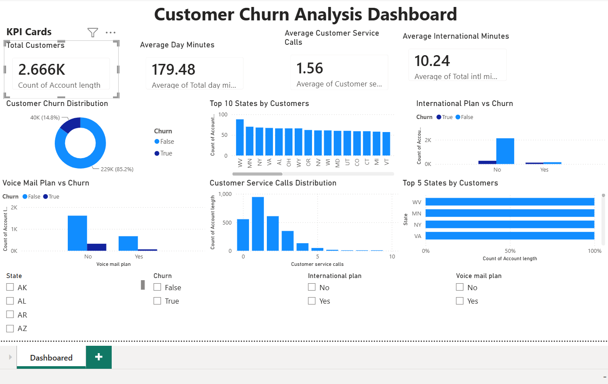
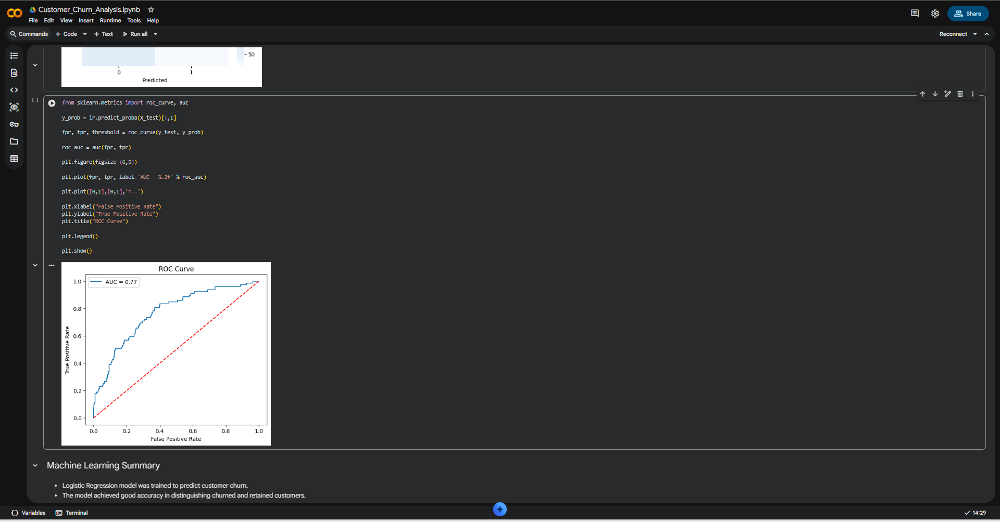
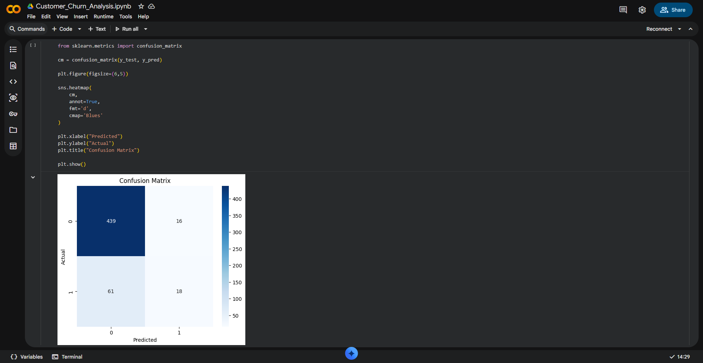
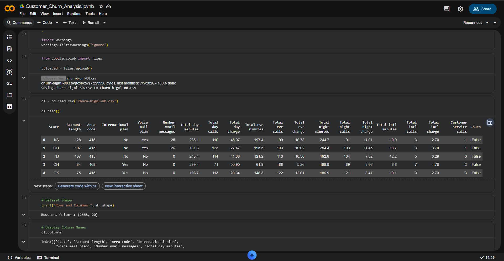

# 📊 Customer Churn Analysis for Telecom Industry

## 📌 Project Overview

Customer churn is one of the biggest challenges faced by telecom companies. This project aims to predict customer churn using Machine Learning, analyze customer behavior using SQL, and create an interactive Power BI dashboard to derive actionable business insights.

This project was completed as part of the **DataX Labs Data Analyst Internship**.

---

## 🎯 Objectives

- Predict customer churn using Machine Learning.
- Analyze customer behavior using SQL.
- Identify factors affecting customer retention.
- Build an interactive Power BI dashboard.
- Provide business recommendations to reduce churn.

---

## 🛠️ Tools & Technologies

- Python
- Google Colab
- Pandas
- NumPy
- Matplotlib
- Seaborn
- Scikit-learn
- SQL (PostgreSQL)
- Power BI

---

## 📂 Dataset

**Dataset:** Telecom Customer Churn Dataset

The dataset contains customer information including:

- State
- Account Length
- Area Code
- International Plan
- Voice Mail Plan
- Customer Service Calls
- Day, Evening, Night & International Usage
- Charges
- Churn Status

---

# 📈 Project Workflow

### 1. Data Loading

- Imported dataset into Google Colab
- Loaded data using Pandas

### 2. Data Preprocessing

- Checked missing values
- Checked duplicates
- Encoded categorical variables
- Feature selection

### 3. Exploratory Data Analysis

- Churn Distribution
- Correlation Heatmap
- Feature Analysis
- Customer Service Calls Analysis

### 4. Machine Learning

- Train-Test Split
- Logistic Regression Model
- Model Training
- Predictions

### 5. Model Evaluation

- Accuracy Score
- Classification Report
- Confusion Matrix
- ROC Curve

### 6. SQL Analysis

Performed analytical SQL queries including:

- Customer Count
- Churn Count
- State-wise Analysis
- International Plan Analysis
- Voice Mail Plan Analysis
- Customer Service Call Analysis
- Average Charges
- Usage Analysis

### 7. Power BI Dashboard

Created an interactive dashboard containing:

- KPI Cards
- Customer Churn Distribution
- Top States by Customers
- International Plan vs Churn
- Voice Mail Plan vs Churn
- Customer Service Calls Distribution
- Interactive Slicers

---

# 📊 Dashboard Preview

## Power BI Dashboard



---

# 📸 Project Screenshots

## ROC Curve



---

## Confusion Matrix



---

## Classification Report



---

# 📌 Key Insights

- Around **85%** of customers were retained.
- Customers with higher customer service calls showed a greater likelihood of churn.
- International plan customers exhibited different churn patterns.
- Voice mail plan usage had an impact on customer retention.

---

# 💡 Business Recommendations

- Improve customer support for high-risk customers.
- Monitor customers with frequent service calls.
- Provide personalized retention offers.
- Promote suitable telecom plans.
- Use predictive analytics to identify potential churn early.

---

# 📁 Repository Structure

```
Customer_Churn_Analysis/
│
├── Customer_Churn_Analysis.ipynb
├── churn-bigml-80.csv
├── customer_churn_queries.sql
├── Customer_Churn_Analysis_Report.pptx
├── requirements.txt
├── README.md
│
├── dashboard.png
├── roc_curve.png
├── confusion_matrix.png
└── classification_report.png
```

---

# ▶️ How to Run

1. Clone this repository.

```
git clone https://github.com/kapasrilakshmi075/Customer_Churn_Analysis.git
```

2. Install dependencies.

```
pip install -r requirements.txt
```

3. Open the notebook.

```
Customer_Churn_Analysis.ipynb
```

4. Run all cells.

---

# 📈 Results

- Successfully predicted telecom customer churn using Logistic Regression.
- Achieved reliable classification performance.
- Performed SQL-based customer analysis.
- Built an interactive Power BI dashboard.
- Generated actionable business insights for customer retention.

---

# 👩‍💻 Author

**Kapa Sri Lakshmi**

B.Tech Computer Science & Engineering

Aspiring Data Analyst

GitHub: https://github.com/kapasrilakshmi075

LinkedIn: https://www.linkedin.com/in/kapa-srilakshmi-4a0602354/

---

## ⭐ If you found this project useful, consider giving it a Star!
